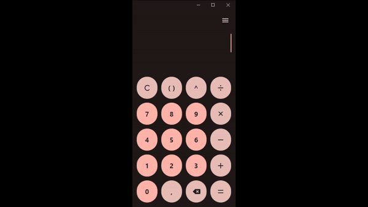

# BetterCalculator

The BetterCalculator is a simple calculator application built with [Flutter](https://flutter.dev/), allowing users to perform basic arithmetic operations on numbers.

## Preview

## Features

- Addition (+)
- Subtraction (-)
- Multiplication (\*)
- Division (/)
- Exponentiation (^)
- Parentheses for grouping operations

## Installation

You can install the by accessing the [GitHub Releases](https://github.com/gbrissi/better_calculator/releases) section.

## License

This project is licensed under the [MIT License](LICENSE).
